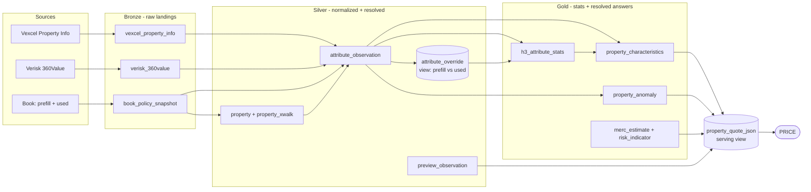
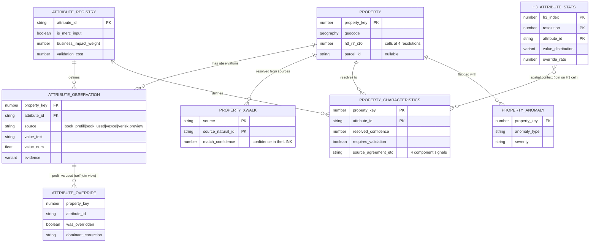

# Data Spine — Design Overview

*Supporting the AI quote flow (PRICE / PREVIEW). Companion to `quote_spine_ddl.sql`, which is the source of truth for exact columns — this doc explains **purpose and relationships**, not every field.*

---

## 1. What this is, in one paragraph

The data spine is the geospatial reference layer under the quote flow. For any address, it reconciles what our **book** believes about a property, what **Vexcel** sees in imagery, and what **Verisk** assumes for rebuild cost — into a single best value per dwelling characteristic, each with a **confidence score** and the **evidence** behind it. PRICE consumes that to decide which attributes it can prefill silently and which it must ask the member to confirm. The point of the whole thing: **ask members fewer questions, and feed the MERC calculation attributes we actually trust.**

---

## 2. What it produces (the payoff)

For each property, the spine outputs the POC JSON — `characteristics`, `attributesRequiringValidation`, `anomalies`, `explainability`, and the MERC sections. The two that drive the business goal:

- **`characteristics`** — every attribute with a resolved value + confidence. High confidence → prefill silently, no member question.
- **`attributesRequiringValidation`** — the short list we *do* ask about, because confidence is low or the attribute matters too much to guess.

Every question we move from the first list is a question the member never sees.

---

## 3. A single property, end to end

This is the whole design in one example. Address comes in for a 1,700 sqft home:

1. **Vexcel** returns `LIVING_AREA = 2,400 sqft`, confidence 0.71.
2. The **book's neighbors** in this property's H3 cell mostly run 1,600–1,900 sqft. 2,400 sits far out in the tail — *low spatial posterior* (method 3).
3. Historically in this cell, prefilled living area gets **overridden ~30% of the time**, almost always **downward** — *low override reliability* (method 2).
4. Meanwhile the record also claims 6 bathrooms in that footprint — *within-property anomaly* (method 1).
5. The spine composes these into a **low resolved confidence** for `LIVING_AREA`, flags it in `attributesRequiringValidation`, and raises an anomaly.
6. Result: the member is asked to confirm square footage, an **inflated MERC is prevented**, and the `explainability` section can say *why* — three sources disagreed, neighbors don't match, this region corrects this field often.

Everything below is just the machinery that makes that happen.

---

## 4. How the pipeline is layered (plain version)

We use a **medallion** layout — a standard three-stage pattern. Read it left to right; data only ever flows one direction.

- **Bronze — raw landing.** Exactly what each source sent us, dumped in as-is and never edited. If we ever need to debug or reprocess, the untouched original is here.
- **Silver — cleaned & connected.** We reshape every source into one common format, and we figure out *which records describe the same house* (entity resolution). This is where the spine actually lives.
- **Gold — ready to serve.** Pre-computed summaries and the final per-property answers, shaped so PRICE can read them fast without doing heavy work at quote time.

Two design choices worth understanding, because they're not obvious:

**Observations are append-only.** We never overwrite an attribute value. Vexcel saying "2,400 sqft" and the book saying "1,700 sqft" are *two rows*, both kept, each stamped with its source. That's what lets "do the sources agree?" become a confidence signal, and it's what powers `explainability`. If we overwrote to a single value, we'd throw away the disagreement that's actually informative.

**The override signal is derived, not captured live.** We can't watch members correcting prefills in real time (no event stream). But the book stores both the **prefilled** value and the final **used** value. Where they differ, that *was* an override — we just read it off the two columns after the fact. Rolled up to an H3 region, that becomes "how often is our prefill wrong here."

---

## 5. Data flow

---

## 6. The three confidence methods (the part to scrutinize)

Each method produces a *separate* signal. We keep them as separate columns on `property_characteristics` and compose them into the final `resolved_confidence`, so `explainability` can always say which one drove the score.

### Method 1 — within-property anomaly
*"These attributes don't fit together."* e.g. 6 bathrooms in 1,000 sqft.
- **Reads:** the full attribute vector for one property (pivoted `attribute_observation`).
- **Writes:** `property_anomaly`, and an `anomaly_penalty` on the characteristic.
- **Scope:** one property at a time. No geospatial component.

### Method 2 — regional override frequency
*"In this area, our prefill for this attribute is wrong a lot."*
- **Reads:** `attribute_override` (the prefill-vs-used view), rolled up to H3.
- **Writes:** `override_rate` + `dominant_correction` on `h3_attribute_stats`; `override_reliability` on the characteristic.
- **Bonus:** because we keep both the *from* and the *to*, we get direction and bias — "prefilled area runs ~15% high here" — not just a wrong/right flag.

### Method 3 — posterior given neighbors
*"How plausible is this value, given the homes around it?"*
- **Reads:** the per-cell value distributions in `h3_attribute_stats`.
- **Writes:** `spatial_posterior` on the characteristic.
- **Sparsity handling:** thin rural cells don't have enough neighbors. We store H3 at resolutions 7–10 and, when a fine cell is sparse, fall back to (shrink toward) its parent cell. `H3_CELL_TO_PARENT` makes the pooling trivial.

### (Bonus) source agreement — nearly free
Because prefill, used, Vexcel, and Verisk all land as separate rows in `attribute_observation`, "do the sources concur?" is a cheap fourth signal (`source_agreement`). Three sources agreeing on roof type is strong evidence; a three-way split is weak.

---

## 7. Core tables and how they relate

Only the 7 core tables + the override view are shown — the pieces that produce confidence. (MERC, risk, and PREVIEW tables hang off the same property key.)

> Note: not every line above is an enforced foreign key. `H3_ATTRIBUTE_STATS → PROPERTY_CHARACTERISTICS` is a *spatial join* (match on the property's H3 cell), and `ATTRIBUTE_OVERRIDE` is a **view** — a saved query that pairs each property's prefill row against its used row — not a stored table.

### Table reference

| Layer | Table | What it's for |
|---|---|---|
| Bronze | `book_policy_snapshot` | Raw book records — carries **both** prefill and used values |
| Bronze | `vexcel_property_info` | Raw Vexcel Property Info payloads |
| Bronze | `verisk_360value` | Raw Verisk responses (MERC + its attribute assumptions) |
| Silver | `attribute_registry` | The catalog of characteristics; flags MERC inputs, impact, ask-cost |
| Silver | `property` | One canonical row per house, with H3 cells precomputed |
| Silver | `property_xwalk` | Which source records map to which property, + confidence in that match |
| Silver | `attribute_observation` | **The spine.** Every value from every source, one row each |
| Silver | `attribute_override` *(view)* | Method-2 signal: prefill vs used, at rest |
| Silver | `preview_observation` | PREVIEW exterior/peril findings from imagery + DSM |
| Gold | `h3_attribute_stats` | Per-cell distributions + override rates (methods 2 & 3) |
| Gold | `property_characteristics` | Resolved value + decomposed confidence per attribute |
| Gold | `property_anomaly` | Method-1 findings / review candidates |
| Gold | `merc_estimate` | Verisk MERC + internal challenger |
| Gold | `risk_indicator` | Property risk signals + importance |
| Serving | `property_quote_json` *(view)* | Assembles the POC JSON PRICE consumes |

---

## 8. Open dependencies (raise these in the review)

1. **Prefill must survive.** The whole method-2 signal assumes the book persists the *original prefill* and the *final used* value as two separate fields. If prefill is overwritten to equal used at bind, that column is empty. **Confirm before loading.**
2. **Entity resolution is the highest-risk join.** Book, Vexcel, and Verisk don't share a key. `property_xwalk` links them on parcel where available, else rooftop geocode / address hash — and carries a confidence *in the match itself*. A bad match silently corrupts every downstream stat, so this deserves real validation.
3. **MERC = Member Estimated Replacement Cost** is the assumed expansion — correct if wrong.
